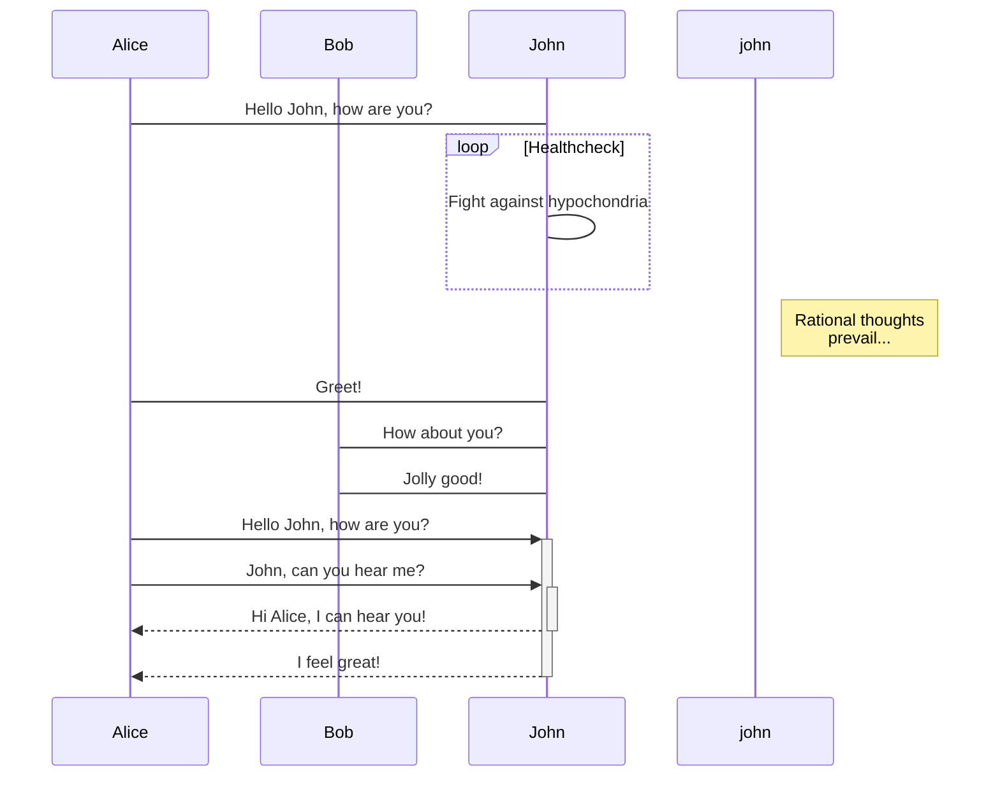
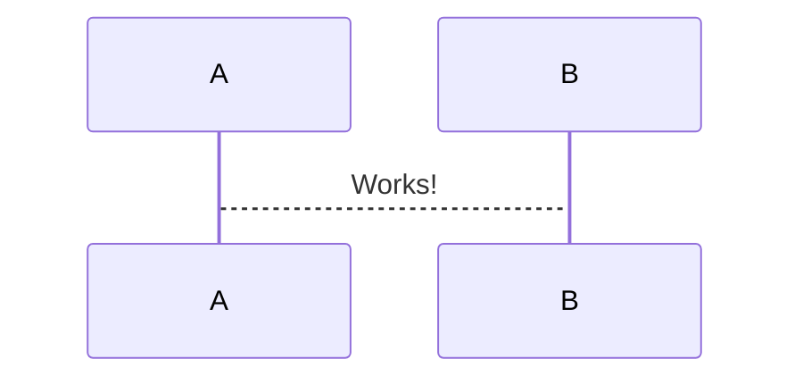

```mermaid
sequenceDiagram
    participant Alice
    participant Bob
    participant John
    Alice -> John: Hello John, how are you?    
    loop Healthcheck
        John -> John: Fight against hypochondria
    end
    Note right of john: Rational thoughts    <br/>prevail...
    John -> Alice: Greet!
    John -> Bob: How about you?
    Bob -> John:  Jolly good!
    Alice->>+John: Hello John, how are you?
    Alice->>+John: John, can you hear me?
    John-->>-Alice: Hi Alice, I can hear you!
    John-->>-Alice: I feel great!    
```

```mermaid
sequenceDiagram
  A-->B: Works!
```