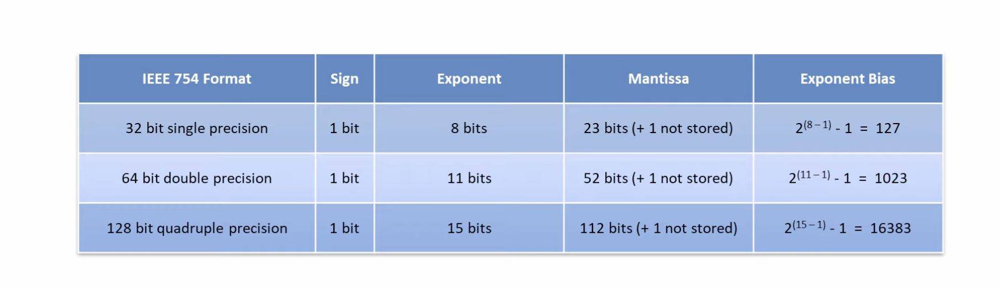
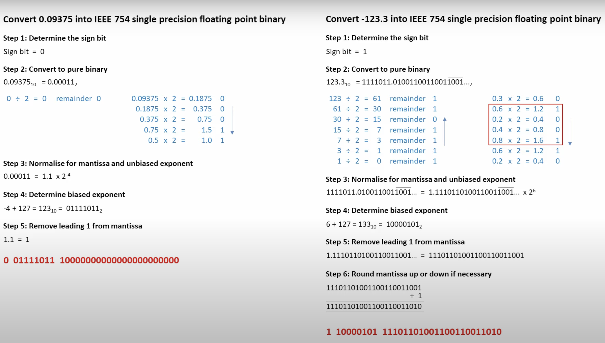
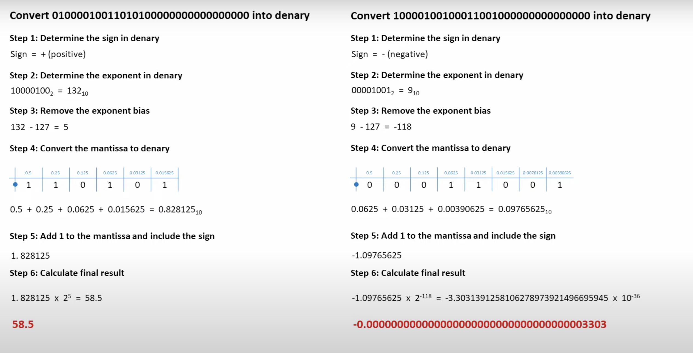
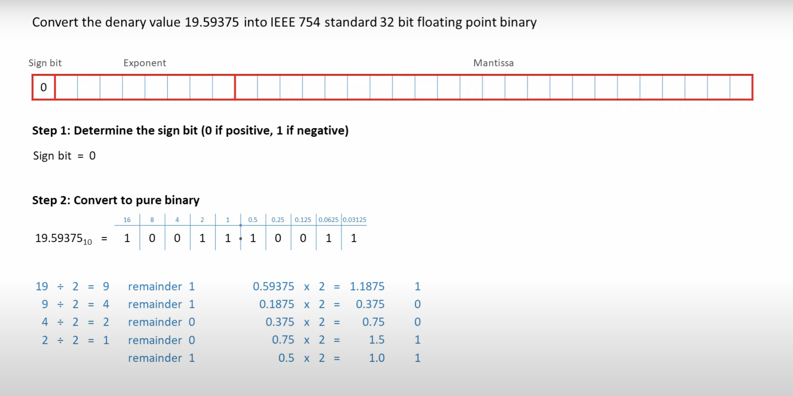
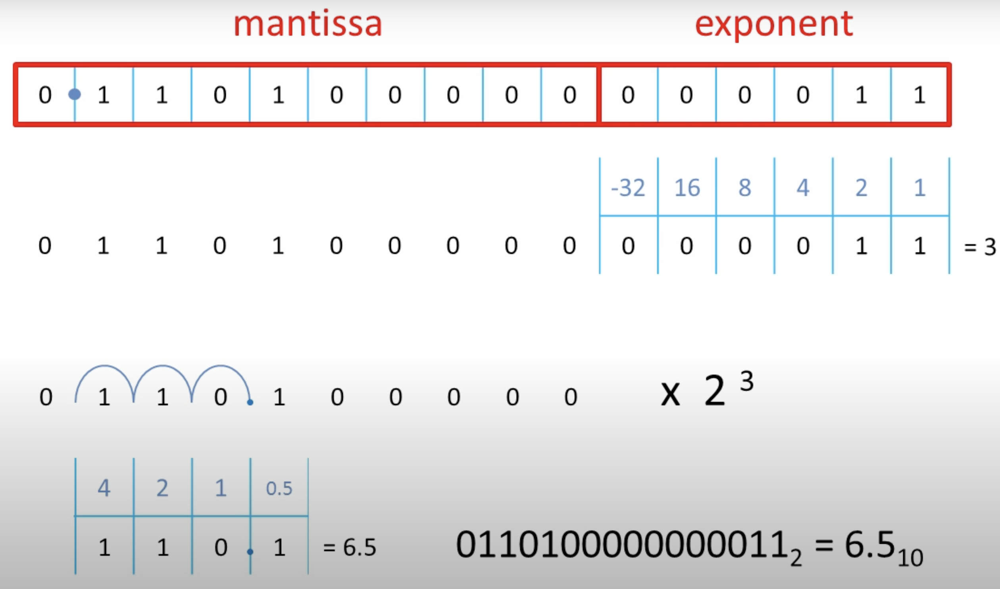
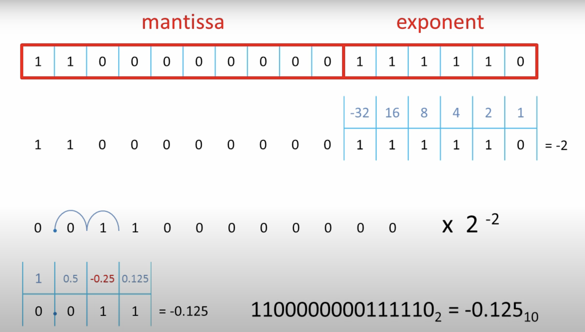

## What is the difference between BigEndian and LittleEndian
1. Order in which msb are stored is different between two
2. Higher significant stored in lower order bytes, hence they travel first in network
3. BigEndian is less commmon and LittleIndian is more widely used on ARM/Intel on MAC/Linux
4. PowerPC and Spark processor uses BigEndian
5. Java.class file and CD-ROW, Mp3 and JPEG also uses BigEndian

## Algorithms uses bigEndian
1. MD5
2. Sha-1

## How many ways to represent floating point numbers

1. Use ISO-Floating-IEEE754 fixed floating point numbers, which has known issues 0.1 + 0.2 != 0.3
1. Floating point binary (scientific form)
    1. Use everything as integer and split them using mantissa and exponent
    1. Exponent would govern the range of the number that is big or small
    1. Mantissa decides how acurate number should (higher mantissa gives more acracy or range of number)
    1. Better precision means smaller range

## What is Biased exponent

1. Using biased exponent, we can have control of how many -ve and +ve numbers can be stored
1. 
1. Binary numbers sorted generally align with decimal number, bigger number later than lower number
1. But 2's complement sorted binary number sort won't align with 10ary sorted number

## How to convert to IEEE-754

1. 
1. 


## Two different representation of real number using binary number with precision and scale (or range)

1. Fixed point floating (1+23+8, 1+52+11) - point is fixed
2. IEEE-754 - 32 bit number - 23 bits
    1. 23 bit mantissa
    1. 8 bit exponent
    1. sign bit

## How to convert 10ary to binary floating point number

1. 19.59375(b10) = 10011.10011
1.     

## In Avro, Hive - what is precision and scale
1. Precision refers to the total number of digits that can be stored, regardless of the decimal point's position.
2. Scale indicates the number of digits that can be stored to the right of the decimal point. The scale must be less than or equal to the precision
3. DECIMAL(precision, scale)

## Can you write program to produce issue with floating point number
```javascript
let x=0;
for(let i=0; i<1000; i++) {
    x+=0.1;
}
console.log(x);
99.9999999999986
```
```java
jshell> 0.1+0.2
$1 ==> 0.30000000000000004
```

## Avro - decimal type
1. Avro type for decimal is specified as bytes. (It has underlying type and logicaltype)
2. Logical Type: This is set to "decimal".

## Decimal(38,19)
1. Maximum number that can be stored in this format would have
    1. 999,999,999,999,999,999.9999999999999999
    1. Nnumber that has 19 nines before the decimal and 19 nines after it
1. Minimum positive number that can be saved 
    1. 0.0000000000000000001

## What are some famous flating point numbers

1. 2.99 * 10^8 m/s -- speed of light
1. 6.02 * 10^23 mole -- avagadro's number
1. 1.60 * 10^-19 C - Charge of electron
1. 4.35 * 10^17 s - Age of universe in seconds
1. 6.02 * 10^23 ~~> 6.02 Mantissa and 10^23 is exponent
1. 6.022140857 * 10^23 ~~> 6.022140857 Number of digits allowed in mantissa governs the precision
1. 1.60 * 10^-19 ~~> 0.00000000000000000016 (18 zeros after decimal point and 16)

## How floating point numbers are stored? [IEE standard]

1. Mantissa and Exponent stored in 2's complment
1. Mantissa and Exponent both has sign number, that is stored in 2's complement
1. Sign number 0 (in 2s complement) - + ve and 1 is -ve


## How to convert binary to decimal using IEE format 011010000000001 - Assuming it is 16 bit register number    
1. 0110100000000011 (Assume last 6 digits are exponent)
1. 011010000-000011
    1. Exponent and Mantissa both are +ve
    1. Exponent 000011 - value is 3 which 2^3 (floating point is 3 place to right for the exponent)
    1. 011010000 -- mantissa value is 6.5 (1 after 0 in mantissa is half)
1.  
1. [0101010000000010 - 2.625](https://youtu.be/L8OYx1I8qNg?t=460)
1. 
1. 
1. Exercise
    1. 13.5 into 16 bit binary number
    1. 0.3125 into 16 bit binary number

## IEE-754 - Floating point standard

1. Precision - number of bits used for Mantissa
1. 24 bit mantissa - single precision
1. 53 bit mantissa - double precision


## Precsion vs Floating point in 8 bit register
1. if 4 bit is for mantissa and 4 bit is for exponent
1. Floating point can float upto 7 digits to the right
1. Floating point can float upto 8 digits to the left
1. 01110111 - Largest mantissa and largest exponent - 112 (in decimal)
1. 00011000 - Smallest mantissa and largest -ve exponent - 0.000288281
1. Since we can't represent more than 256 number, we can't represent all the numbers between 0.000288281 to 112 (there would be gaps)
1. Example: We can't represent 7.5 with 4 bit mantissa and 4 bit exponent
1. In floating point number, multiple bit position can represent the same value
    1. It might represent less than 256 unique values in 8 bit register for decimal
1. Accracy often depends on precision, but not always
1. There are multiple numbers that can't be represented by binary

## Precsion vs Floating point in 8 bit register[5,3]

1. If we operate with 3 digitis for scale (range) and 5 digit for mantissa
1. 01111011 ~> 01111 is Manitssa and 011 is exponent
1. 01111011 - Maximum number can be 7.5
1. 00001100 - Maximum number can be 0.00390625

## How to multiple 3*10^8 + 1.5*10^-7

1. 300000000 + 0.00000015
2. 1/3 = 0.333.... (recurring digits 10ary world)
3. 0.1 = 1/10 = 0.0001100110011001100110011 (recurring digits in binary world)
4. When recurring binary digits added with other number, it looses acuracy.
5. 

## How is BigInteger is saved internally?

1. let us say N = 2**70+5 == 1180591620717411303425 == 1000000000000000000000000000000000000000000000000000000000000000101
2. N would be split into 32-bit chunks {10000000000000000000000000000000 (32 bits), 00000000000000000000000000000000 (32 bits), 00000000000000000000000000000101 (32 bits)} 
3. int[] value = { 5, 0, 1073741824 };  // base-2^32 chunks
4. signum = 1
5. 
    ```java
    // Define the large number 2^70 + 5
        BigInteger bigInt = BigInteger.valueOf(2).pow(70).add(BigInteger.valueOf(5));
        // Print the value
        System.out.println("BigInteger value: " + bigInt);        
        // Print the internal representation
        System.out.println("BigInteger internal array: " + java.util.Arrays.toString(bigInt.toByteArray()));
    ```
6. [0x40, 0x00, 0x00, 0x00, 0x00, 0x00, 0x00, 0x00, 0x05] //Buffere representation, 0x40 ~= 64xx``x``

## How to store 128 BigDecimal in java
```
    import java.nio.*;

    // toDecimal(1958l, 0l, (short) -3).equals(  new BigDecimal("1.958"))

    public static BigDecimal toDecimal(long mantissaLow, long mantissaHigh, short exponent) {        
        var buffer = ByteBuffer.allocate(128).order(ByteOrder.LITTLE_ENDIAN);
        buffer.putLong(0, mantissaLow);
        buffer.putLong(8, mantissaHigh);
        byte[] mantissaBytes = buffer.array();
        reverse(mantissaBytes);
        BigInteger mantissa = new BigInteger(1, mantissaBytes);
        return new BigDecimal(mantissa, (int)-exponent);
    }


    public static void reverse(byte[] array) {
        int left = 0, right = array.length - 1;        
        while (left < right) {
            // Swap elements at left and right indices
            byte temp = array[left];
            array[left++] = array[right];
            array[right--] = temp;            
        }
    }
```


## Reference
1. [How floating point numbers are stored](https://youtu.be/L8OYx1I8qNg?si=5Lnnh0Nqalibd53h)
2. [Bits_And_Binary numbers](https://github.com/mohanmca/CodingChallenges/blob/master/src/md/coding_patterns/25_bits_binary_anki.md)
3. [IEEE 754 Standard for Floating Point Binary Arithmetic](https://www.youtube.com/watch?v=RuKkePyo9zk)
4. [Floating Point Numbers - Computerphile](https://www.youtube.com/watch?v=PZRI1IfStY0)

## How to create MD anki
mdanki src/main/md/BetterDeveloper/daily_practice.md dp.apkg --deck "Mohan::DeepWork::Java::BigDecimal"
