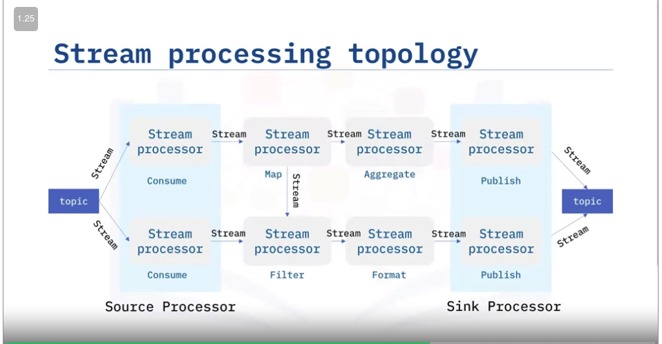

## What is this course
1. Data Processing Techniques
   1. What is ETL Process
   2. ELT is an emerging trend
   3. The shift from ETL to ELT
   4. Examples of raw data sources
   5. Parallel loading
   6. Batch vs stream loading
2. ETL and Data Pipelines
   1. Temperature reporting workflow
   2. What is the data pipeline
   3. Handling unbalanced loads
   4. Batch vs stream requirements
   5. Streaming data pipeline tools
3. Building data pipelines - Using Airflow
   1. Using Airflow principles
   2. Airflow pipeline script
   3. Advantages of workflow as code
   4. Visualizing DAG
   5. Airflow pipeline
   6. Logging
4. M4  - Building Streaming Pipelines Using Kafka
   1. Event Broker
   2. Apache Kafka
   3. A weather pipeline example
   4. Kafka Streams API
5. M5 - Final project

## What is ETL

* ETL stands for Extract, Transform, and Load. 
* It refers to the process with 3 steps 
  1. Curating data from multiple sources - Extract
  2. Preparing the data for integration  - Transform
  3. Loading into a destination platform such as a data warehouse or analytics environment. - Load

## Well known transformations
1. Cleaning: fixing any errors or missing values  
2. Filtering: selecting only what is needed  
3. Joining: merging disparate data sources  
4. Normalizing: converting data to common units  
5. Data Structuring: converting one data format to another, such as JSON, XML, or CSV to database tables 
6. Feature Engineering: creating KPIs for dashboards or machine learning   
7. Anonymizing and Encrypting: ensuring privacy and security
8. Formatting and data typing
9. Sorting: ordering the data to improve search performance
10. Aggregating: summarizing granular data 

## What is dataloading
1. Moving data into a new environment
   1. DB
   2. Cloud


## ELT

1. ELT transformation is more dynamic
2. Transforming data on demand
3. Demanding scalability requirements of Big Data
4. Streaming Analytics
5. Integration of highly distributed data sources
6. Multiple data products from the same sources
7. Why
   1. Cloud Computing
      1. Do the transform on demand
   2. ELT separates the data pipeline from the processing
   3. No information loss

## ETL vs ELT
1. ELT can be used for adhoc, and self-service-data analytics
2. ELT is evolution of ETL
3. ELT solves scalability and structured, un-structured data
4. ETL - would take time to specify transformation
5. ELT - emerged due to demand for access to raw data

## ETL - Staging area
1. ETL - Staging area already means like ELT
2. It represents private landing zone inside ETL
3. But it is not globally accessible like modern day ELT

## Data Extraction Techniques

1. Analog way of extraction
   1. OCR
   2. ADC sampling, CCD sampling
   3. Mail, phone or in-person surveys and polss
2. Cookies, user logs
3. Webs crapping
4. API
5. Database Querying
6. Edge computing
7. Biomedical devices

## Schema-on-write vs schema-on-read
1. Schema on write (ETL)
   1. To RDBMS (write would fail if data is not strictly following the schema)
   2. Consistency and efficiency
   3. Limited versatility
2. Schema-on-read (Avro, proto-buf) (ELT)
   1. Versatility
   2. Enhanced storage flexibility = more data

## Information loss in transformation
1. Loss data is big
2. Transformed data would generally shrink
3. Lossy data compression (float to int)
4. Filtering (subset of data)
5. Aggregation
   1. Only avg is sourced
6. Edge computing devices


## Data loading techniques

1. Batch loading vs stream loading
   1. Periodic updates using windows of data
   2. Continuous updates as data arrives (Flink - near realtime)
   3. Micro-batch loading (Spark technique)
      1. Short time windows used to access older data
2. Push vs Pull
   1. Pull - requests for data originate from the client
      1. Example: RSS, Emails
   2. Data can be pushed to clients
      1. Client subscribes to the service provided by server
      2. Example: Push notification, instant messaging
3. Parallel loading vs Serial loading
   1. Multiple data steams
   2. For long distance data replication
   3. Splitting single file into smaller chunks and load to destination
   4. Parallel loading can boost loading efficiency
4. Full
   1. New data warehouse
5. Incremental
   1. Data is appended to, not overwritten
6. Scheduled vs On-demand
   1. Periodic loading, like daily transactions to database
   2. Windows Task Scheduler, cron

## Data Load

1. The load phase is all about writing the transformed data to a target system. The system can be as simple as a comma-separated file, which is essentially just a table of data like an Excel spreadsheet. The target can also be a database, which may be part of a much more elaborate system, such as a data warehouse, a data mart, data lake, or some other unified, centralized data store forming the basis for analysis, modeling, and data-driven decision making by business analysts, managers, executives, data scientists, and users at all levels of the enterprise.
2. In most cases, as data is being loaded into a database, the constraints defined by its schema must be satisfied for the workflow to run successfully. The schema, a set of rules called integrity constraints, includes rules such as uniqueness, referential integrity, and mandatory fields. Thus such requirements imposed on the loading phase help ensure overall data quality.

## Batch processing triggers

1. when the source data reaches a certain size, or
2. when an event of interest occurs and is detected by a system, such as an intruder alert, or
3. on-demand, with web apps such as music or video streaming service

## ETL Pipeline

1. ETL pipelines are frequently used to integrate data from disparate and usually siloed systems within the enterprise.


## Modern enterprise grade ETL tool features
1. Automation: Fully automated pipelines
2. Ease of use: ETL rule recommendations
3. Drag-and-drop interface: “o-code” rules and data flows
4. Transformation support: Assistance with complex calculations
5. Security and Compliance: Data encryption and HIPAA, GDPR compliance

## Popular ETL Tools
1. Talend
2. AWS Glue
3. IBM InfoSphere
4. Alteryx
5. Apache Airflow and Python
6. Pandas Python Library
   1. Suitable Prototyping for ETL, data exploration
   

## Apache Airflow
1. Airflow represents your workflow as a directed acyclic graph (DAG).
2. Airflow tasks can be expressed using predefined templates, called operators
3. Popular operators include Bash operators, for running Bash code, and Python operators for running Python code

## ETL Using shell scripting

```bash
create table access_log(timestamp TIMESTAMP, latitude float, longitude float, visitor_id varchar(37))
cut -d"#" -f1,2,3,4 web-server-access-log.txt | tr '#' ',' > access_log.csv
cut -d"#" -f1,2,3,4 web-server-access-log.txt > extracted-data.txt
tr '#' ',' < extracted-data.txt > transformed.csv

echo "\c template1;\COPY access_log  FROM '/home/project/transformed.csv' DELIMITERS ',' CSV HEADER;;SELECT * from access_log;" | psql --username=postgres --host=localhost
echo "\c template1;SELECT * from access_log;" | psql --username=postgres --host=localhost
```

## Introduction to Data Pipelines
1. Data pipeline performance are measured using latency and throughput
   1. Total latency
   2. Individual Latencies
2. Packet flow through a pipeline
3. Larger data per unit of time equals greater throughput

## What is a data pipeline
1. Series of connected processes
2. Output of one process is input of the next
3. To move data from one place to another
4. System which extracts, transforms and loads data

## What is a data pipeline
1. Includes low-level hardware architectures
2. Software-driven processes - commands, programs and threads
3. Bash `pipe` command can connect such a processes together

## Data pipeline use-cases
1. Backing up files
2. Integrating disparate raw data sources into a data lake
3. Moving transaction records to a data warehouse
4. Streaming data from IOT devices to DB/BI
5. Preparing raw data for ML

## Key Data pipeline processes
1. Loading into destination facility
2. Scheduling or triggering
3. Monitoring
4. Maintenance and optimization

## Data pipeline monitoring consideration
1. Latency and throughput
2. Utilization rate
3. Logging and alerting system
4. Load balanced pipelines
   1. JIT data packet relays
   2. No upstream data flow bottlenecks
   3. Uniform packet throughput for each stage
   4. Such a pipeline is called "load balanced"

## Handling unbalanced loads
1. Pipelines typically contain bottlenecks
2. Slower stages may be parallelized to speed up throughput
3. Processes can be replicated on multiple CPU/cores/threads
4. Data packets are then distributed across these channels
5. Such pipelines are called dynamic or non-linear

## Stage synchronization
1. I/O buffers can help synchronize stages
2. Holding area for data between processing stages
3. Buffers regulate the flow of data, may improve throughput

## Batch process vs Stream Processing
1. Stream processing is emerging
2. Smaller batches improve load balancing, lower latency
3. Accuracy vs latency requirements
4. Lambda architecture - Hybrid architecture
   1. Combines batch and streaming architecture
   2. Logical complexity is its drawback
5. Stream processing
   1. Intruder detection
   2. Social media feeds
   3. Fraud Detection
   4. Advertising
   5. Recommended system
   6. Stock trading

## Data modelling on slowly varying data
1. Batch is suitable for slowly varying data

## Data pipeline tools and technologies
1. Automation: Fully automated pipelines
2. East of use: ETL rule recommendation
3. Drag-and-Drop: No-code rules and data flows
4. Transformation support: Assistance with complex calculations

## Pandas Python Library  as ETL tool
1. great for prototyping, won't scale
2. Spark, Vaex and Dask can help to scale up
3. Consider SQL like alternatives

## Apache Airflow (from Airbnb)
1. Configuration as code data pipeline
2. Programmatically author, schedule and monitor workflows
3. Scales to big data
4. Integrates with cloud platforms


## Talend Open Studio
1. Open source
2. Bigdata, dw and profiling
3. DANDD GUI
4. Automatically generates java code
5. Connects with many data warehouses
   1. Google sheets
   2. RDBMS
   3. IBM DB2 & Oracle

## AWS Glue
1. Fully managed
2. Can crawl datasource to discover data formats
   1. Suggests schema to create
3. ETL service that simplifies data prep for analytics
4. Suggests schemas for storing your data
5. Create ETL jobs from AWS console

## Panoply
1. Focus on ELT
2. No-Code data integration

## Alteryx
1. Self service data analytics platform
2. No Sql or coding experience required


## IBM InfoSphere DataStage
1. ETL Studio
2. DANDDUI
3. Supports prallel procesing

## IBM Streams
1. Build real-time analytical applications
2. Based on Kafka
3. Reached EOL as on 2022, supported till 2024/September

## Other stream data pipeline tools
1. Apache Storm
2. SQLstream
3. Apache Samaza
4. Apache Spark
5. Apache Flink
6. Azure stream analytics
7. Apache Kafka

## Airflow
1. Python library + UI + Scheduler + Metadata + Executor + Worker + WebServer (for UI)
2. Apache Airflow is scalable, dynamic, extensible, and lean
   1. Scalable: Airflow has a modular architecture and uses a message queue to orchestrate an arbitrary number of workers.
      1. It is ready to scale to infinity.
   2. Dynamic: Airflow pipelines are defined in Python, and allow dynamic pipeline generation. Thus, your pipelines can contain multiple simultaneous tasks.
   3. Extensible: You can easily define your own operators and extend libraries to suit your environment.
   4. Lean: Airflow pipelines are lean and explicit. Parameterization is built into its core using the powerful Jinja templating engine
3. ‘schedule_interval’ parameter specifies how often to re-run your DAG

## Airflow Environment
```bash
airflow dags list - list out all the existing DAGs.
airflow tasks list example_bash_operator -  list out all the tasks in the DAG named example_bash_operator
airflow dags unpause tutorial
airflow dags pause tutorial
airflow dags list-import-errors
```

## Airflow Dag Definition script

1. Library Imports
2. DAG arguments
3. DAG definition
4. Task definition
5. Task pipeline


## Example Airflow python script

```python
#simple_example_DAG.py
from airflow import DAG
from aiflow.operators.bash_operator import BashOperator
import datetime as dt

default_args = {
   'owner': 'me',
   'start_date': dt.datetime(2021, 7, 28),
   'retries' : 1,
   'retry_delay'" dt.timedelta(minutes=5),
}

dag = DAG('simple_example', description='A simple example DAG', 
         default_args = default_args, schedule_interval=dt.timedelta(seconds=5), 
      )

task1 = BashOperator (
   task_id = 'print_hello',
   bash_command='echo \'Greetings. the date and time are \'',
   dag=dag
) 

task2 = BashOperator (
   task_id = 'print_date',
   bash_command = 'date',
   dag=dag,
)

task1 >> tas2
```

## How to deploy the DAG to airflow

1. cp my_first_dag.py $AIRFLOW_HOME/dags
2. airflow dags list | grep my-first
   1. task_id will be displayed from the argument value that we pass to Operators
   2. Variable name won't be displayed as output

## How to monitor Airflow DAG
1. Logging
2. Logs can be identified using dag_id and task_id
   1. logs/dag_id/task_id/execution_ate/try_number.log
   2. logs/dummy_dag/task1/2021-07-29T00:17:00+00:00/1.log
3. Monitoring metrics for Airflow
   1. Counters - Always increase
      1. Number of successes and failures
   2. Gauges - fluctuate
      1. Number of running tasks
      2. DAG bag size, or number of DAGs in production
   3. Timers - time duration
      1. Milliseconds to finish a task
4. Airflow recommends that production deployment metrics be sent to and analyzed by Prometheus via StatsD
5. Recommends sending the logs to ElasticSearch

## Typical tasks working with Airflow

1. Search for a DAG.
2. Pause/Unpause a DAG.
3. Get the Details of a DAG.
4. Explore grid view of a DAG.
5. Explore graph view of a DAG.
6. Explore Calendar view of a DAG.
7. Explore Task Duration view of a DAG.
8. Explore Details view of a DAG.
9. View the source code of a DAG.
10. Delete a DAG.

## Distributed Event Streaming Platform Components
1. Event - describes an entity's observable state updates over time
2. Event streaming - from one event source to one destination

## Main components of ESP

* ESP acts as middle layer for various sources and destinations to serve stream processing
  * All source can send only to ESP
  * All consumers can retrieve from ESP
* Common components of ESP
  * Event broker, which is designed to receive and consume  events.
  * Event Storage, which is used for storing events being received from event sources.
* Event broker components
  * Ingester, processor, and consumption.
    * The Ingester is designed to efficiently receive events from various event sources.
    * The processor performs operations on data such as serializing and deserializing; compressing and decompressing; encryption and decryption; and so on.
    * The consumption component retrieves events from event storage and efficiently distributes them to subscribed event destinations.

## Apache Kafka ESP

1. Common use cases
   1. User activities
   2. Metrics streaming
   3. Logs streaming
   4. Financial Transactions
2. Destinations of Kafka
   1. Databases
   2. Analytics
   3. Notifications
   4. Governance and audit

## Apache Kafka Architecture

1. Distributed Client Server architecture
   2. Many associated servers are called Brokers
      1. Brokers are managed by Zookeeper (leader selection)
2. Handle bytes
3. Client
   1. CLI
   2. High level api
   3. Rest API
4. Why famous
   1. Highly scalable
   2. Highly reliable
   3. Distributed system (not singlepoint failure)
   4. Permanent persistent
   5. Open source
5. Providers
   1. IBM event streams
   2. Confluent
   3. Amazon MSK
6. Order is maintained within partition
7. Same object goes through same partition

## Building event stream processing using Kafka

1. Topics are partitioned and replicated
   1. Topics can be considered like tables for events
2. There would be multiple broker processes
   1. Even if they are down kafka can work
3. log_partition_0 and log_partition_1 can be accommodated on different brokers
4. Supports key-value events

```bash
kafka-topics
kafka-console-producer
kafka-console-consumer
```

```bash
kafka-topics --bootstrap-server localhost:9092 --topic log_topic --create --partitions 2 --replication-factor 2
kafka-topics --bootstrap-server localhost:9092 --list
kafka-topics --bootstrap-server localhost:9092 --topic log_topic --delete
kafka-topics --bootstrap-server localhost:9092 --describe log_topic
 
kafka-console-producer --broker-list localhost:9092 --topic log_topic < inputs_from_files
kafka-console-producer --broker-list localhost:9092 --topic log_topic --property parse.key=true -property key.separator=,
> user1, login website
> user1, click buttoon on the left menu for purchase

kafka-console-consumer --bootstrap-server localhost:9092 --topic log_topic
kafka-console-consumer --bootstrap-server localhost:9092 --topic log_topic --from-beginning 
```

## Kafka Stream Process (and topology)
1. Kafka Streams API
   1. Simple client library facilitate data processing in event streaming pipelines
   2. Processes and analyses data stored in kafka topics
   3. Record only processed once
   4. Processes one record at a time
2. Kafka Stream Topology (Computational Graph)
   1. 
   2. Each node is Stream processor
   3. Each node receives streams from upstream
   4. Each node also acts as upstream for other consumer
   5. Each node does, map, filter and reduce
   6. Source and Sync processor are special one
3. Application
   1. Any application that processes streams maps and filters are called stream processor
4. Partition and Offset
   1. The offset of an empty Partition 0 of bankbranch is 0, and if you publish the first message to the partition, its offset will be 1.
   
## Kafka installation

```bash
wget https://archive.apache.org/dist/kafka/2.8.0/kafka_2.12-2.8.0.tgz
tar -xzf kafka_2.12-2.8.0.tgz
cd kafka_2.12-2.8.0
bin/zookeeper-server-start.sh config/zookeeper.properties
cd kafka_2.12-2.8.0
bin/kafka-server-start.sh config/server.properties
cd kafka_2.12-2.8.0
bin/kafka-topics.sh --create --topic news --bootstrap-server localhost:9092
bin/kafka-topics.sh --bootstrap-server localhost:9092 --list
bin/kafka-console-producer.sh --topic news --bootstrap-server localhost:9092
bin/kafka-console-consumer.sh --topic weather --bootstrap-server localhost:9092 --from-beginning
/tmp/kakfa-logs
bin/kafka-topics.sh --create --topic bankbranch --bootstrap-server localhost:9092 --partitions 2
bin/kafka-topics.sh --bootstrap-server localhost:9092 --describe --topic bankbranch
bin/kafka-console-producer.sh --bootstrap-server localhost:9092 --topic bankbranch
{"atmid": 1, "transid": 100}
{"atmid": 1, "transid": 101}
{"atmid": 2, "transid": 200} 
{"atmid": 2, "transid": 200}
{"atmid": 2, "transid": 200} 

bin/kafka-console-producer.sh --bootstrap-server localhost:9092 --topic bankbranch --property parse.key=true --property key.separator=:
bin/kafka-console-consumer.sh --bootstrap-server localhost:9092 --topic bankbranch --group atm-app
bin/kafka-consumer-groups.sh --bootstrap-server localhost:9092 --describe --group atm-app
--to go back two messages for the entire consumer-groups
bin/kafka-consumer-groups.sh --bootstrap-server localhost:9092  --topic bankbranch --group atm-app --reset-offsets --shift-by -2 --execute
--we get number of consumer times 2 message, since above line offset was moved by 2
bin/kafka-console-consumer.sh --bootstrap-server localhost:9092 --topic bankbranch --group atm-app
```

## Consumer Group
1. We normally group related consumers together as a consumer group.
   1. For example, we may want to create a consumer for each ATM in the bank and manage all ATM related consumers together in a group

## [etl-and-data-pipelines-shell-airflow-kafka](https://www.coursera.org/learn/etl-and-data-pipelines-shell-airflow-kafka/lecture/J9fAf/course-intro-video)
1. [ETL DW](https://github.com/mboccenti/ETL-and-Data-Pipelines-with-Shell-Airflow-and-Kafka)
2. [Airflow](https://stackoverflow.com/questions/tagged/airflow-2.x)