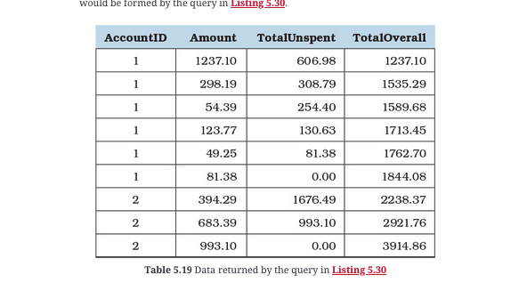

## Other Sql References.
1. [Effective SQL](Effective_SQL.md)
2. [Advanced SQL](Advanced_SQL.md)
3. [SQL](Sql.md)

## [What is Window function?](Effective-SQL:Item 37: Know How to Use Window Functions)
1. “Window” refers to a set of rows that surround a considered row, either preceding or following that row.

## [What is impact of Partition by in Window function?](Effective-SQL:Item 37: Know How to Use Window Functions)
1. PARTITION BY predicate specifies how the window should be divided.
   1. If partition by is omitted, your database system applies the function over the entire result set
3. Partition BY results are sensitive to the order in which the rows are returned.
   1. Query may have different predicates for each OVER clause

## [What is impact of if Partition by is missing in Window function?](Effective-SQL:Item 37: Know How to Use Window Functions)   
1. If there is no partition-clause or oder-by given... aggregate function work like group-by
   1. select account_id, amount, SUM(amount) OVER() AS total_sum from account;

## When to use Window functions
1. Window functions are “aware” of the surrounding rows.
2. Which makes it easier to create running or moving aggregations than with the traditional aggregation functions
3. It also helps at statement-level grouping.
   
## Can we Partition by multiple columns?
1. Yes!
2. PARTITION BY s.CustomerID, s.PurchaseMonth   ORDER BY s.PurchaseYear -- is valid statement


## What are few function that could be used for window function?
1. Many of the aggregate functions SUM(), COUNT(), AVG(), and others, can be used as window functions.
2. ROW_NUMBER() and RANK()

## When is Order by mandatory in window functions
1. Whenever you need to change the window frame’s bounding to a non-default setting, you must specify an ORDER BY predicate even when it is optional.

## When to use Window function Rows

1. If you need to define an arbitrary size for a window frame, you must use ROWS, which allows you to input how many rows preceding or following are to be included in the window frame.

## When to use Window function Range
1. RANGE can accept only UNBOUNDED PRECEDING, CURRENT ROW, or UNBOUNDED FOLLOWING as valid options.

## When to use Window function Range vs Rows
You can choose between RANGE for logical grouping of rows and ROWS for physical offset of the rows. If the ORDER BY predicate does not return duplicate values, the results are equivalent

## When to use SubQuery

1. Use a subquery anywhere you can use a table name
2. A scalar subquery - Use a subquery that returns a single column wherever you can use a list of values—for example, in an IN clause.
3. A subquery that returns one column and zero or only one value can be used anywhere you can use a column name or a single literal.

## Where to use SubQuery
1. Subquery in several places in another SELECT, UPDATE, INSERT, or DELETE statement.

## How many times inner-query in co-related subquery executed

1. if outer query processess million records, inner co-related subquery also executed million times

## For inner join, what are all the expression allowed?

1. Any logic that you can use in a WHERE clause can be used in your JOIN clauses 
2. More complicated joins can read very much like a WHERE clause.
3. Examples
   1. JOIN t2 ON t2.column = t1.column
   2. JOIN t2 ON t2.column LIKE t1.column**

## Example of Scalar Subquery, find all employee whose salary is greater than avg-salary

```sql
select * from employee
where salary > (select avg(salary) from Employee)
```

```sql
select e.* from employee e 
   inner join (select avg(salary) salary from Employee) avg_salary
   on e.salary > avg_salary.salary
```

## Example of Multi-Row Subquery, find all employee whose salary is highest in their department

```sql
select * from employee e where (salary, department_id) in (select max(salary), department_id from salary group by department_id
```

## In Delivery : customer_pref_delivery_date = order_date, find the percentage of record 

```sql
select
    round(100 * sum(customer_pref_delivery_date = order_date) / sum(1), 2)
    as immediate_percentage
from Delivery;

SELECT 
   ROUND(100*AVG(order_date = customer_pref_delivery_date), 2) AS immediate_percentage
FROM Delivery;
```

## How to find list of department that has no employee working
```
select * from department d where not exists (
   select 1 from employee e where e.depart_name = d.depart_name
)
```

## Find stores whose sales where better than the average sales across all stores

```sql
select * from (
      select store_name, sum(price) as total_sales from sales group by store_name
   )  sales
join
   (select avg(total_sales) as sales from (
       select store_name, sum(price) as total_sales from sales group by store_name) x
      ) avg_sales 
   on sales.total_sales > avg_sales.sales;
---
with sales as (   select store_name, sum(price) as total_sales from sales group by store_name )
   select * from sales
   join (select avg(total_sales) as sales from sales x) avg_sales
   on sales.total_sales > avg_sales.sales   
---
select store_name from sales group by stores having sum(sales) > (select avg(price) from sales) 
```

## Where can we use SubQuery

1. Select
2. From
3. Where
4. Having


## Fetch all employee details and add remarks to those employees who earn more than the avg salary

```sql
select *,
   (case when salary > (select avg(salary) from employee) then 'Higher than average'
   else null end) as remarks
from
employee   

--
select *,
   (case when salary > avg_salary.sal) then 'Higher than average'
   else null end) as remarks
from
employee   
cross join (select avg(salary) sal from employee) avg_salary;
```


## Find the stores who have sold more units than avg units sold by all stores

```sql
select store_name, sum(quantity) from sales group by store_name having sum(quantity) > (select avg(quantiy) from sales);
```

## How to insert data into employee history table. Make sure not insert duplicate records
```sql
insert into employee_history
select e.emp_id, e.emp_name, d.dept_name, e.salary, d.location from employee e
join department d on d.dept_name = e.dept_name
where not exists (select 1 from employee_history eh where eh.emp_id = e.emp_id)
```

## How to Give 10% increment to all employees in Bangalore location based on the maximum salary earned by an emp in each dept. Only consider employees in employee_history table
```sql
update employee e
   set salary = (select max(salary) * 1.1 from employee_history eh where eh.dept_name = e.dept_name)
where e.dept_name in (select dept_name from department where location='Bangalore')
   and e.emp_id in (select emp_id from employee_history)   
```

## Delete all departments who do not have any employees
```sql
delete from department d
   where d.deparement id not in (select 1 from employee e where e.dept_name = d.dept_name)
--    
delete from department d  where depatment_name in (
   select dept_name from department d where not exists  (select 1 from employee e where e.dept_name = d.dept_name)
) 
```

## Example of Multiple Inner Join

```sql
  SELECT Recipes.RecipeID, Recipes.RecipeTitle FROM 
  Recipes INNER JOIN Recipe_Ingredients  ON Recipes.RecipeID = Recipe_Ingredients.RecipeID
          INNER JOIN Ingredients   ON Ingredients.IngredientID =  Recipe_Ingredients.IngredientID  
  WHERE Ingredients.IngredientName = 'Beef'
```

## Find all Receipes that has Beef and Garlic

```sql
SELECT BeefRecipes.RecipeTitle
FROM 
  (SELECT Recipes.RecipeID, Recipes.RecipeTitle
   FROM (Recipes INNER JOIN Recipe_Ingredients
    ON Recipes.RecipeID = Recipe_Ingredients.RecipeID) 
      INNER JOIN Ingredients 
    ON Ingredients.IngredientID = 
      Recipe_Ingredients.IngredientID
   WHERE Ingredients.IngredientName = 'Beef') 
      AS BeefRecipes
  INNER JOIN
  (SELECT Recipe_Ingredients.RecipeID
   FROM Recipe_Ingredients INNER JOIN Ingredients
    ON Ingredients.IngredientID = 
      Recipe_Ingredients.IngredientID
   WHERE Ingredients.IngredientName = 'Garlic') 
      AS GarlicRecipes 
    ON BeefRecipes.RecipeID = GarlicRecipes.RecipeID;
```

## [1303. Find the Team Size Employee: emp_id, team_id](https://leetcode.com/problems/find-the-team-size/description/)
```
select employee_id, count(team_id) over (partition by team_id) as team_size from employee
order by employee_id

with team_size as (select count(1) as team_size, team_id from Employee group by team_id)
select employee_id, team_size.team_size from Employee e inner join team_size on team_size.team_id = e.team_id
```

## Find all Order that has both Skateboard and Helmet

```sql
-- Ensure you've run SalesOrdersStructure.sql
-- and SalesOrdersData.sql in the Sample Databases folder
-- in order to run this example. 

USE SalesOrdersSample;
GO

SELECT Customers.CustomerID, Customers.CustFirstName, 
  Customers.CustLastName, Orders.OrderNumber, Orders.OrderDate
FROM Customers
  INNER JOIN Orders
    ON Customers.CustomerID = Orders.CustomerID
WHERE EXISTS 
  (SELECT NULL 
   FROM (Orders AS O2
      INNER JOIN Order_Details
        ON O2.OrderNumber = Order_Details.OrderNumber)
      INNER JOIN Products
        ON Products.ProductNumber = Order_Details.ProductNumber 
   WHERE Products.ProductName = 'Skateboard' 
    AND O2.OrderNumber = Orders.OrderNumber)
AND EXISTS 
  (SELECT NULL
   FROM (Orders AS O3 
      INNER JOIN Order_Details
        ON O3.OrderNumber = Order_Details.OrderNumber)
      INNER JOIN Products
        ON Products.ProductNumber = Order_Details.ProductNumber 
   WHERE Products.ProductName = 'Helmet'
      AND O3.OrderNumber = Orders.OrderNumber);
```

## What is the Lag() function, give an example?
1. LAG() function provides access to a row that comes before the current row at a specified physical offset. In other words, from the current row the LAG() function can access data of the previous row, or the row before the previous row, and so on.
```java
WITH cte AS (
	SELECT year, SUM(amount) amount
	FROM sales	GROUP BY year	ORDER BY year
) 
SELECT
	year, 
	amount,
	LAG(amount,1) OVER (ORDER BY year) previous_year_sales
FROM
	cte;
```

## Finding products not ordered in December 2015 using a single-column table subquery

```sql
SELECT Products.ProductName FROM Products
WHERE Products.ProductNumber NOT IN 
  (SELECT Order_Details.ProductNumber 
   FROM Orders 
      INNER JOIN Order_Details
        ON Orders.OrderNumber = Order_Details.OrderNumber
   WHERE Orders.OrderDate 
    BETWEEN '2015-12-01' AND '2015-12-31');
```

## Scalar SubQuery

```sql
SELECT Products.ProductNumber, Products.ProductName, (
    SELECT MAX(Orders.OrderDate)
    FROM Orders
      INNER JOIN Order_Details
      ON Orders.OrderNumber = Order_Details.OrderNumber    WHERE Order_Details.ProductNumber = Products.ProductNumber
    ) AS LastOrder
FROM Products;
```

## Example of Sum(Amount) using Window Function

```sql
SUM(t.Amount) OVER (PARTITION BY t.AccountID ORDER BY t.TransactionID DESC) - t.Amount AS TotalUnspent,
```

## Example of RANK() using Window Function

```sql
RANK() OVER (    PARTITION BY o.CustomerID    ORDER BY o.OrderTotal DESC    ) AS CustomerOrderRanking
```

## [SQL Trick when two types and count involved-1445. Apples & Oranges](https://leetcode.com/problems/apples-oranges/description/)

```sql
select sale_date, sum(case when fruit='apples' then sold_num else -sold_num end) as diff
from sales group by sale_date

select a.sale_date, a.sold_num - b.sold_num as diff from Sales a inner join Sales b on a.sale_date = b.sale_date
and a.fruit='apples' and b.fruit = 'oranges'
order by a.sale_date
```

## Find TotalByCustomer - running sum for each customer, TotalOverall - and entire order Expected: "CustomerID, OrderNumber, OrderTotal, TotalByCustomer and TotalOverall"

```sql
SELECT  o.OrderNumber, o.CustomerID, o.OrderTotal, 
        SUM(o.OrderTotal) OVER (PARTITION BY o.CustomerID ORDER BY o.OrderNumber, o.CustomerID) AS TotalByCustomer, 
        SUM(o.OrderTotal) OVER (ORDER BY o.OrderNumber) AS TotalOverall
FROM Orders AS o
ORDER BY o.OrderNumber, o.CustomerID;
```

## Find total-unspent using different predicate for each over clause, Transaction: Amount, AccountId, TransactionId

```sql
SELECT  t.AccountID, t.Amount, 
        SUM(t.Amount) OVER (PARTITION BY t.AccountID ORDER BY t.TransactionID DESC) - t.Amount AS TotalUnspent, 
        SUM(t.Amount) OVER (ORDER BY t.TransactionID) AS TotalOverall
FROM Transactions AS t
ORDER BY t.TransactionID
```


## Find OrderSequence, CustomerOrderSequence, OrderRanking, CustomerOrderRanking

```sql
SET search_path = SalesOrdersSample;

SELECT 
  ROW_NUMBER() OVER ( ORDER BY o.OrderDate) AS OrderSequence,
  ROW_NUMBER() OVER ( PARTITION BY o.CustomerID   ORDER BY o.OrderDate ) AS CustomerOrderSequence,
  o.OrderNumber, o.CustomerID, o.OrderDate, o.OrderTotal,
  RANK() OVER (    ORDER BY o.OrderTotal DESC  ) AS OrderRanking,
  RANK() OVER (    PARTITION BY o.CustomerID    ORDER BY o.OrderTotal DESC    ) AS CustomerOrderRanking
FROM Orders AS o
ORDER BY o.OrderDate;
```

##[Demonstration of moving average window functions](5.34 -Effective SQL)
```sql
SELECT  s.CustomerID, s.PurchaseYear, s.PurchaseMonth,
  LAG(s.PurchaseTotal, 1) OVER (PARTITION BY s.CustomerID, s.PurchaseMonth  ORDER BY s.PurchaseYear ) AS PreviousMonthTotal,
  s.PurchaseTotal AS CurrentMonthTotal,
  LEAD(s.PurchaseTotal, 1) OVER (PARTITION BY s.CustomerID, s.PurchaseMonth ORDER BY s.PurchaseYear ) AS NextMonthTotal,
  AVG(s.PurchaseTotal) OVER ( PARTITION BY s.CustomerID, s.PurchaseMonth    ORDER BY s.PurchaseYear    ROWS BETWEEN 1 PRECEDING AND 1 FOLLOWING  ) AS MonthOfYearAverage
FROM PurchaseStatistics AS s
ORDER BY s.CustomerID, s.PurchaseYear, s.PurchaseMonth;
```

## [Demonstration of a query with both RANGE and ROWS](5.34 -Effective SQL)
```sql
SELECT
  s.CustomerID, s.PurchaseYear, s.PurchaseMonth,
  SUM(s.PurchaseCount) OVER (    PARTITION BY s.PurchaseYear
    ORDER BY s.CustomerID
    RANGE BETWEEN UNBOUNDED PRECEDING AND CURRENT ROW
  ) AS CountByRange,

  SUM(s.PurchaseCount) OVER (
    PARTITION BY s.PurchaseYear
    ORDER BY s.CustomerID
    ROWS BETWEEN UNBOUNDED PRECEDING AND CURRENT ROW
  ) AS CountByRows

FROM PurchaseStatistics AS s
ORDER BY s.CustomerID, s.PurchaseYear, s.PurchaseMonth;
```


## How to create anki from this boot mock question file
1. [Effective-SQL/PostgreSQL/Chapter 05/Listing 5.031.sql](https://github.com/TexanInParis/Effective-SQL/blob/8047973838c2780da1795742793016faff36315c/PostgreSQL/Chapter%2005/Listing%205.031.sql#L10)
2. [Crack SQL Interview Question: Subquery vs. CTE](https://towardsdatascience.com/sql-for-data-analysis-subquery-vs-cte-699ef629d9eb)
```
mdanki Advanced_Sql.md Advanced_Sql.apkg --deck "Mohan::Pack::Advanced_Sql"
```
