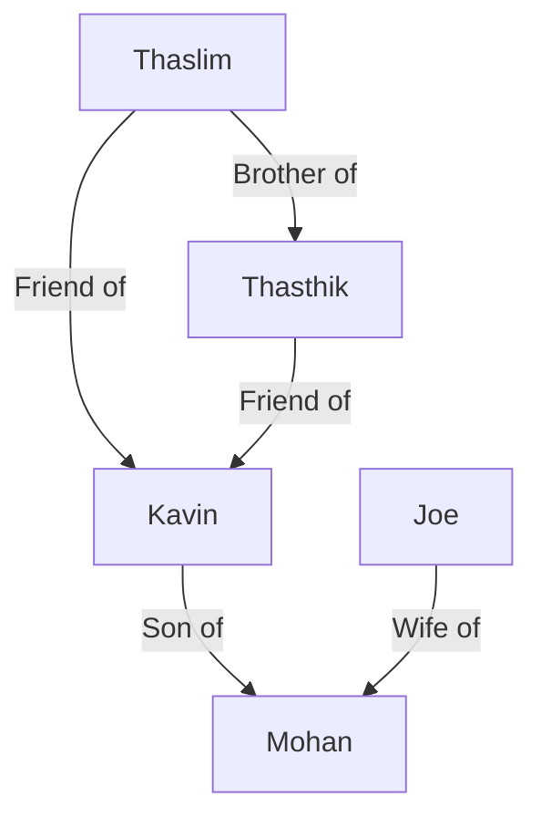

* Generate SVG diagram from text
* Generates Sequence diagram and flowchart
* Graph can be layed out using
  * TD - Top down
  * LR - Left to right
* Features  
  * You can change the shape of the nodes
  * Label the edges
  * 

* https://mermaidjs.github.io/sequenceDiagram.html
* https://mermaidjs.github.io/gantt.html